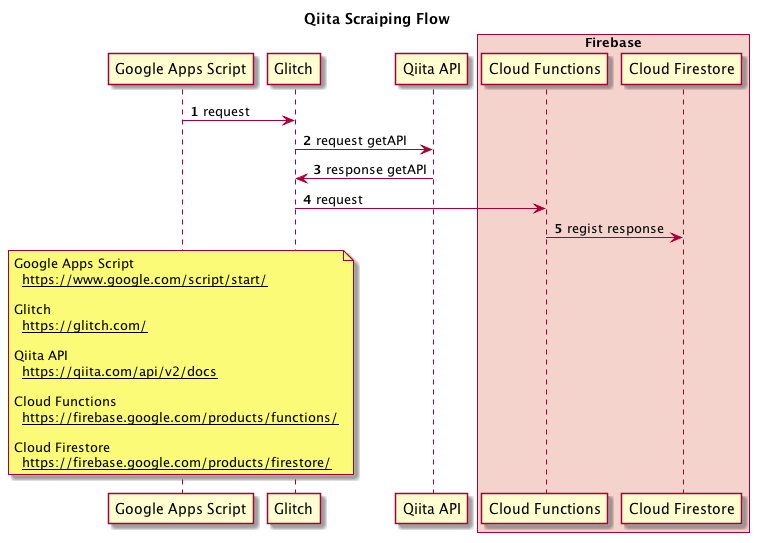
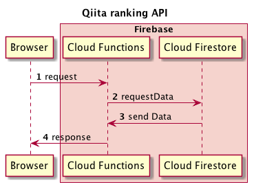

# qiita-scraiping

Qiita投稿記事のいいね数ランキング保存&取得API。<br>
以下2つのランキングが取得可能。<br>

- 日別いいね数ランキング(投稿翌日までのいいね数ランキング)
- 週別いいね数ランキング(投稿翌日から7日間のいいね数ランキング)

※どちらのランキングも2時間毎に最新化。<br>

#### データ登録フロー


#### データ取得フロー


# Dependency

- Node.js (言語)
- Google Apps Script (ジョブスケジューラとして利用)
- Glitch (スクレイピング用サーバとして利用)
- Cloud Functions (Firestoreへの登録用)
- Cloud Firestore (データストア)

# Usage

## ランキング取得 API
`https://us-central1-qiita-trend-web-scraping.cloudfunctions.net/qiitaScraiping/{type}/{YYYY-MM-DD}`

#### {type}
`daily` or `weekly`

- daily ・・・日別ランキング
- weekly ・・・週別ランキング

#### {YYYY-MM-DD}

ランキング登録日。<br>
※2018/9/23 以降が取得可能。

### e.g.)

- URL<br>
  https://us-central1-qiita-trend-web-scraping.cloudfunctions.net/qiitaScraiping/weekly/2018-09-23

- Response<br>

```json
{
  "data": [
    {
      "updated_at": "2018-09-19T12:29:34+09:00",
      "url": "https://qiita.com/mikan3rd/items/ba4737023f08bb2ca161",
      "user": {
        "items_count": 24,
        "name": "",
        "followees_count": 19,
        "id": "mikan3rd",
        "website_url": "https://www.wantedly.com/users/809162",
        "github_login_name": "mikan3rd",
        "profile_image_url": "https://avatars2.githubusercontent.com/u/27764298?v=3",
        "followers_count": 71,
        "location": "Tokyo",
        "twitter_screen_name": "mikan_the_third",
        "organization": "",
        "permanent_id": 178077,
        "facebook_id": "",
        "linkedin_id": "",
        "description": "文系から転職したエンジニア2年生。\r\nReactとPythonがちょっと書ける"
      },
      "id": "ba4737023f08bb2ca161",
      "tags": [
        {
          "versions": [],
          "name": "Python"
        },
        {
          "name": "Instagram",
          "versions": []
        },
        {
          "name": "GoogleCloudPlatform",
          "versions": []
        }
      ],
      "created_at": "2018-09-17T21:12:27+09:00",
      "title": "[2018] 個人でも使える！おすすめAPI一覧",
      "likes_count": 1209
    },
    {
      "url": "https://qiita.com/tkrkt/items/2fc9a9a59ce679aab728",
      "user": {
        "facebook_id": "",
        "linkedin_id": "",
        "description": "趣味エンジニアです。",
        "items_count": 15,
        "name": "",
        "followees_count": 4,
        "id": "tkrkt",
        "website_url": "",
        "github_login_name": "tkrkt",
        "profile_image_url": "https://qiita-image-store.s3.amazonaws.com/0/60243/profile-images/1473695175",
        "followers_count": 34,
        "location": "",
        "twitter_screen_name": null,
        "organization": "",
        "permanent_id": 60243
      },
      "id": "2fc9a9a59ce679aab728",
      "tags": [
        {
          "versions": [],
          "name": "コメント"
        },
        {
          "name": "VSCode",
          "versions": []
        }
      ],
      "created_at": "2018-09-20T21:19:45+09:00",
      "title": "なぜ我々はいまだに文字列でコメントを書いているのか",
      "likes_count": 909,
      "updated_at": "2018-09-21T18:34:38+09:00"
    },
    {"以下略"}
  ]
}
```

# Licence

This software is released under the MIT License, see LICENSE.

# Authors

[zonbitamago](https://github.com/zonbitamago)

# References

[Google Apps Script](https://www.google.com/script/start/)<br>
[Glitch](https://glitch.com/)<br>
[Qiita API](https://qiita.com/api/v2/docs)<br>
[Cloud Functions](https://firebase.google.com/products/functions/)<br>
[Cloud Firestore](https://firebase.google.com/products/firestore/)<br>
